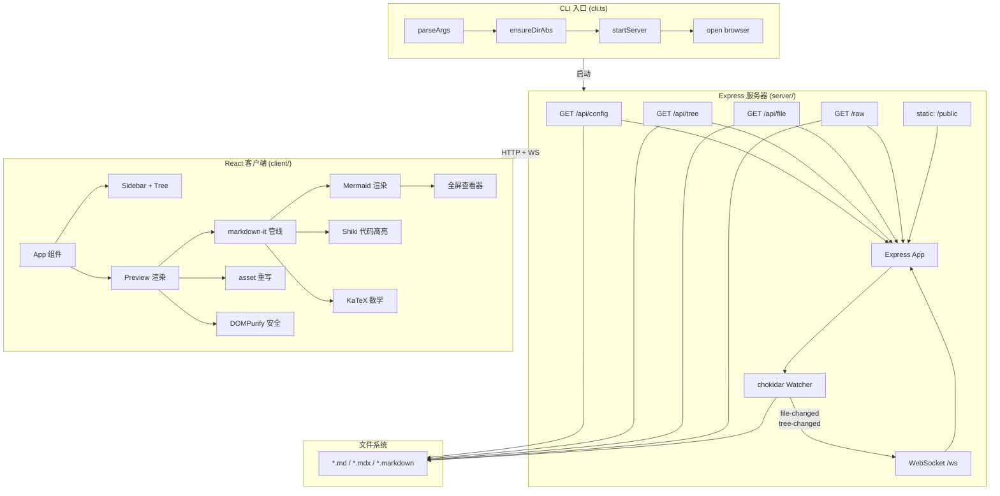
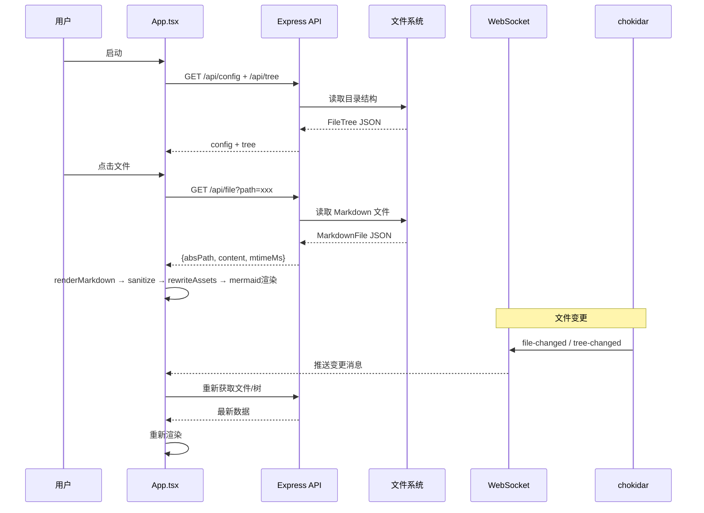
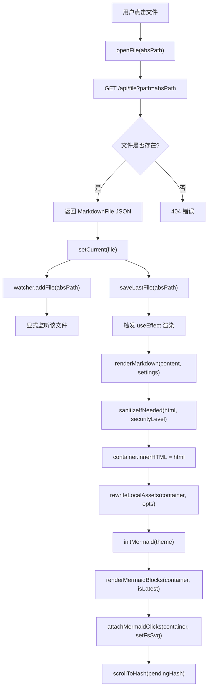
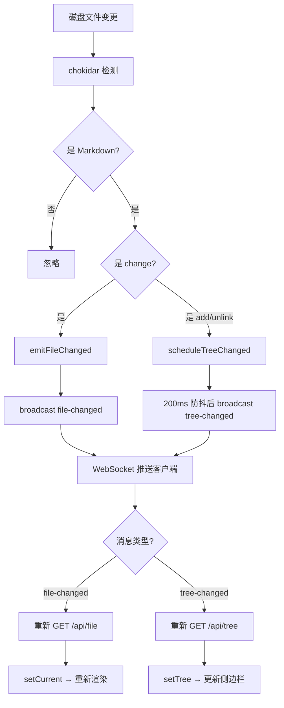
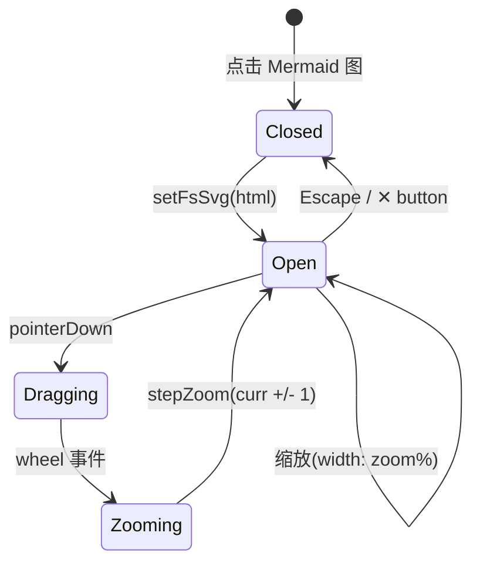

# vibe-viewer 深度架构文档

> 版本: 0.1.2 | 许可证: MIT | Node.js >= 18.18

---

## 1 项目全局摘要

vibe-viewer 是一个零配置本地 Markdown 浏览器，通过 `npx vibe-viewer` 一键启动，在浏览器中提供侧边栏文件树 + 实时预览的编辑体验。核心价值链：

```
本地文件系统 → Express API + chokidar 监听 → WebSocket 推送 → React 浏览器渲染
```

**关键数据**：
- 源文件 20 个，总代码量约 2200 行（不含 CSS 449 行）
- 零外部数据库，纯文件系统驱动
- 依赖栈：Express 5 + React 19 + Mermaid 11 + markdown-it + Shiki + KaTeX
- 构建工具：esbuild（单一构建脚本，无 webpack/vite）

**一句话定义**：本地 Markdown 文件的实时预览浏览器，核心是"文件系统扫描 → Markdown 渲染管线 → 热更新推送"这条数据流。

---

## 2 系统架构分析

### 2.1 架构总图



### 2.2 数据流与状态模型



### 2.3 核心架构决策

| 决策 | 选择 | 原因 |
|------|------|------|
| 渲染引擎 | markdown-it（浏览器端） | 插件生态丰富，支持 anchor/emoji/katex/task-lists |
| Mermaid 全屏 | `` + Blob URL 隔离 | SVG 内嵌 CSS 变量在 `` 上下文不可解析，需文本替换 |
| 文件监听 | chokidar + EMFILE 降级 | 大目录可能触及系统 fd 限制，需自动降级为显式监听 |
| 全屏缩放 | CSS `width: ${zoom}%` | 比 CSS transform-scale 更清晰，避免子元素重排 |
| 全屏平移 | `transform: translate()` | 无限画布，无边界限制，配合 `setPointerCapture` 防丢帧 |
| 侧边栏折叠 | CSS Grid `0px` 列 + `visibility:hidden` | 避免组件卸载导致的滚动位置丢失 |
| 主题系统 | CSS 变量 + JS 动态注入 | 运行时切换，无闪烁（`app.tsx` 顶层立即应用） |

---

## 3 核心模块代码深度解析

### 3.1 CLI 入口 (`src/cli.ts`)

**职责**：命令行参数解析 + 交互式目录选择 + 服务器启动

**关键流程**：
```
parseArgs → ensureDirAbs → startServer → open browser → 注册 SIGINT/SIGTERM
```

**数据结构**：
- `parseArgs(argv)` → `Record<string, string | boolean>`：支持 `--dir`, `--no-open`, `--help`
- `ensureDirAbs(input)` → 绝对路径验证，空输入取 `process.cwd()`
- `askDirInteractively()`：使用 `prompts` 库交互式选择目录，支持异步验证

**设计品味**：简洁、无特殊情况分支。`ensureDirAbs` 把相对路径、空输入、绝对路径统一为 `path.resolve(process.cwd(), raw)` 一条路径，消除了路径处理的分支。

### 3.2 服务器核心 (`src/server/index.ts`)

**职责**：Express HTTP 服务器 + WebSocket 服务 + 路由挂载

**关键路由**：

| 路由 | 方法 | 用途 |
|------|------|------|
| `/api/config` | GET | 返回 `{rootAbs, rootName, extensions}` |
| `/api/tree` | GET | 递归扫描目录，返回嵌套 `TreeItem[]` |
| `/api/file` | GET | 读取单个 Markdown 文件，返回 `{absPath, relPath, content, mtimeMs, size}` |
| `/raw` | GET | 原始文件代理（图片、视频等） |
| `/ws` | WebSocket | 实时推送 `file-changed` / `tree-changed` |
| `/*` | GET | SPA fallback → `index.html` |

**连接管理**：
- TCP socket 追踪 (`sockets: Set<Socket>`)，关闭时逐个 `destroy()`
- WebSocket 客户端追踪 (`clients: Set<WebSocket>`)，广播时只向 `OPEN` 状态的连接发送

**安全注意**：`/raw` 路径接受绝对路径参数，存在路径遍历风险（已知 Issue，Roadmap Epic 4 标记修复）。

### 3.3 文件树与 API (`src/server/api.ts`)

**职责**：目录扫描 + Markdown 文件读取 + 路径验证

**核心数据结构**：

```typescript
interface TreeItem {
  type: "dir" | "file";
  name: string;
  relPath: string;      // POSIX 相对路径
  children?: TreeItem[];
  absPath?: string;       // 仅 file 类型
  mtimeMs?: number;
  size?: number;
}

interface FileTree {
  rootAbs: string;
  rootName: string;
  generatedAt: number;
  items: TreeItem[];
}

interface MarkdownFile {
  absPath: string;
  relPath: string | null;
  mtimeMs: number;
  size: number;
  content: string;        // 原始 Markdown 文本
}
```

**关键函数**：

`scanDir(dirAbs, relDir, rootAbs, extensions)`：
- 递归扫描目录，跳过 `.git`、`node_modules`、`.DS_Store`
- 仅收集 `.md/.mdx/.markdown` 扩展名文件
- 排序策略：目录在前，文件在后；同类按 `localeCompare("zh-CN")` 排序
- 空目录被过滤（`sub.length > 0` 才推入 children）

`isSubpath(rootAbs, targetAbs)`：用 `path.relative()` 检测目标路径是否在 root 之下，防止路径遍历。

`readMarkdownFile(absPath, rootAbs, extensions)`：读取文件内容 + `fs.stat` 元数据，计算相对路径或在 root 之外时 `relPath: null`。

### 3.4 文件监听器 (`src/server/watcher.ts`)

**职责**：chokidar 文件监听 + EMFILE 降级策略

**核心机制**：
1. 初始化：递归监听 `rootAbs` 目录，仅关注 Markdown 扩展名
2. `awaitWriteFinish`：200ms 稳定期 + 50ms 轮询，防止文件正在写入时触发多次
3. EMFILE/ENOSPC 降级：捕获错误后自动切换到"仅显式监听"模式
4. 显式监听集合 `EXPLICIT_FILES`：客户端打开文件时通过 `watcher.addFile(absPath)` 添加

**降级流程**：
```
chokidal.watch(rootNorm) → EMFILE error → degradeWatchMode()
                                     → chokidar.watch([]) 空目录
                                     → 仅 add EXPLICIT_FILES 中已打开的文件
```

**广播去抖**：`scheduleTreeChanged()` 使用 200ms `setTimeout` 去抖，避免短时间内多次 `tree-changed` 广播。

### 3.5 React 主应用 (`src/client/components/App.tsx`)

**职责**：全局状态管理 + 文件操作 + WebSocket 连接 + 主题应用

**状态模型**：
```typescript
config: Config | null          // rootAbs, rootName, extensions
tree: FileTree | null           // 目录树
filter: string                  // 文件过滤关键词
settings: Settings              // 主题、安全级别、换行、emoji、数学
current: MarkdownFile | null    // 当前打开的文件
pendingHash: string | null      // URL hash 跳转目标
wsStatus: "connecting" | "open" | "closed"
error: string | null            // 错误信息
sidebarOpen: boolean            // 侧边栏开关
```

**初始化流程**：
1. `Promise.all([fetchJson("/api/config"), fetchJson("/api/tree")])` 并行获取配置和文件树
2. 优先加载 `localStorage` 中的上次文件（`vv:lastFile`），否则取文件树第一个文件
3. WebSocket 连接持续监听 `file-changed` 和 `tree-changed`

**主题应用策略**：`useEffect(() => { saveSettings(settings); applyThemeCSS(settings.theme); }, [settings])`，在 `app.tsx` 入口还做了同步应用防止闪烁。

**侧边栏折叠**：
```
app--collapsed → grid-template-columns: 0px 1fr
                sidebar: visibility:hidden; opacity:0; pointer-events:none
                展开按钮: position:fixed; left:12px; z-index:100
```

### 3.6 Markdown 渲染管线 (`src/client/markdown.ts`)

**职责**：markdown-it 配置 + 插件链组合

**管线流程**：
```
原始 Markdown → markdown-it 初始化
  → markdown-it-anchor (slug + permalink)
  → markdown-it-emoji (可选)
  → markdown-it-katex (可选)
  → markdown-it-task-lists
  → fence 规则重写
     ├── lang === "mermaid" → <div class="mermaid">...</div>
     └── 其他 → Shiki codeToHtml (降级为默认 fence)
→ HTML string
```

**安全级别影响**：
- `allow-all`：`html: true`，不阻止 javascript: 协议
- `allow-html`：`html: true`，DOMPurify 过滤，阻止 javascript: / vbscript:
- `strict`：`html: false`，阻止 data: 和危险协议

### 3.7 Mermaid 渲染 (`src/client/mermaid.ts`)

**职责**：Mermaid 11.x 初始化 + 批量渲染

**关键实现**：
- `initMermaid(theme)`：仅首次调用 `mermaid.initialize()`，后续调用只更新 `theme`
- `renderMermaidBlocks(container, {isLatest})`：遍历 `.bm-diagram` 前的 `.mermaid` div，逐个调用 `mermaid.render(id, text)`
- 渲染结果包裹为 `<div class="bm-diagram">`，替换原始 `<div class="mermaid">`
- 失败时创建 `<div class="bm-error">` 错误提示（中文）
- `isLatest()` 闭包确保竞态安全：如果渲染期间组件更新，丢弃过期结果

### 3.8 全屏 Mermaid 查看器 (`src/client/components/Preview.tsx`)

**核心组件：FullscreenViewer**

**数据结构**：
```typescript
zoom: number                    // 当前缩放百分比
pan: { x: number, y: number }  // 平移偏移
dragRef: { active, sx, sy, px, py }  // 拖拽状态
```

**缩放阶梯**：`[20, 40, 60, 80, 100, 130, 160, 200, 260, 320, 400, 500]`

**关键实现细节**：

1. **CSS 变量替换** (`svgToImgUrl`)：
   - Mermaid SVG 输出中可能包含 `var(--mono)`、`var(--ui)`、`var(--content)` 等 CSS 变量引用
   - `` 标签创建独立的渲染上下文，无法访问页面 CSS 变量
   - 解决方案：在创建 Blob 前将 `var(--*)` 替换为实际字体栈值

2. **无限画布平移**：
   - `transform: translate(${pan.x}px, ${pan.y}px)` + `transform-origin: 0 0`
   - `pointer-events: none` 在 `` 上，拖拽事件由 `.fs-viewport` 接管
   - `setPointerCapture(e.pointerId)` 防止拖拽过程中丢帧

3. **滚轮缩放**：
   - 必须 `addEventListener(wheel, fn, {passive: false})`，因为 React onWheel 是 passive 的，`preventDefault()` 无效
   - 缩放步进而非连续缩放，提供可预测的用户体验

4. **主题适配**：
   - 暗色主题：`background: rgba(10, 15, 25, 0.88)`
   - 亮色主题 (`fs-light`)：`background: rgba(235, 240, 245, 0.94)` + 按钮颜色反转

### 3.9 主题系统 (`src/client/themes.ts`)

**数据结构**：
```typescript
interface ThemeDef {
  name: string;            // 唯一标识符
  label: string;           // 显示名称
  type: "dark" | "light";  // 明暗类型
  mermaid: "dark" | "default" | "neutral" | "forest" | "base";  // Mermaid 主题映射
  vars: Record<string, string>;  // CSS 变量映射
}
```

**8 个内置主题**：
| 主题名 | 类型 | Mermaid 映射 |
|--------|------|---------------|
| github-dark | dark | dark |
| github-light | light | default |
| nord | dark | dark |
| dracula | dark | dark |
| catppuccin | dark | dark |
| solarized-dark | dark | dark |
| one-dark | dark | dark |
| monokai | dark | dark |

每个主题定义 30+ CSS 变量，覆盖：背景（root/panel/hover/active/input/code/pre/blockquote/th/bm）、边框（border/dashed/active）、文字（text/heading/muted/code/icon）、强调色（accent 系列 6 个）、危险色、阴影、渐变。

**CSS 变量系统**：所有 2 个 CSS 自定义属性（`--mono`, `--ui`, `--content` 为字体栈）+ 30+ 主题变量，通过 `document.documentElement.style.setProperty()` 运行时注入。

### 3.10 资产重写 (`src/client/assets.ts`)

**职责**：将 Markdown 渲染后的本地资源路径转换为 `/raw?path=` URL

**核心函数 `rewriteLocalAssets(container, opts)`**：

1. **图片/视频/音频 `<src>`**：
   - 外部 URL、`data:`、`mailto:`、`tel:`、`#` 锚点 → 保持不变
   - `javascript:`/`vbscript:` 协议 → 根据 `securityLevel` 阻止或放行
   - 本地相对路径 → `resolveToAbsPath()` → `/raw?path=encodeURIComponent(abs)`
   - 图片 fallback：绝对路径（非 FS 路径）先试 `/raw`，失败后 fallback 为原始路径

2. **链接 `<a href>`**：
   - 外部链接 → 保持不变
   - Markdown 文件（`.md/.mdx/.markdown`） → `preventDefault` + `openMarkdownFile(abs, hash)`
   - 其他本地文件 → `/raw?path=` + `target="_blank" rel="noreferrer"`

### 3.11 安全模块 (`src/client/security.ts`)

**职责**：DOMPurify 净化 + 协议阻止

`sanitizeIfNeeded(html, securityLevel)`：
- 仅在 `securityLevel === "allow-html"` 时执行 DOMPurify 过滤
- 兼容浏览器和 SSR 环境
- `allow-all` 模式不过滤（信任本地内容）
- `strict` 模式在 markdown-it 层已禁用 HTML

`isBlockedProtocol(url)`：阻止 `javascript:` 和 `vbscript:` 协议。

### 3.12 代码高亮 (`src/client/highlight.ts`)

**单例模式**：`highlighterPromise` 确保只初始化一次 `shiki.Highlighter`。

**配置**：
- 主题：`github-dark`（硬编码，暂不支持动态切换）
- 语言：`bash, css, html, javascript, json, jsx, markdown, tsx, typescript, yaml`

### 3.13 WebSocket 客户端 (`src/client/ws.ts`)

**职责**：自动重连的 WebSocket 客户端

**机制**：
- 连接断开后 800ms 自动重连
- `closedByUser` 标志防止主动关闭后重连
- 消息类型：`file-changed` / `tree-changed`
- 返回 `{ close() }` 清理接口

### 3.14 设置持久化 (`src/client/state/store.ts`)

**存储键**：
- `vv:settings`：完整 Settings 对象 JSON
- `vv:lastFile`：上次打开的文件绝对路径

**默认值**：
```typescript
{ securityLevel: "allow-all", breaks: false, emoji: true, math: true, theme: "github-dark" }
```

### 3.15 路径工具 (`src/client/paths.ts`)

**核心函数**：
- `posixDirname(absPath)`：提取 POSIX 目录部分
- `posixNormalize(p)`：去除 `.` 和 `..`，统一分隔符为 `/`
- `posixJoin(a, b)`：POSIX 路径拼接 + 规范化
- `looksLikeAbsoluteFsPath(url)`：检测 macOS/Linux 绝对路径前缀（`/Users/`、`/Volumes/`、`/private/`、`/opt/`、`/var/`）
- `splitHref(href)`：分离路径、查询字符串和哈希

### 3.16 文件树组件 (`src/client/components/Tree.tsx`)

**职责**：递归渲染目录树 + 过滤 + 折叠

**过滤算法** `filterTree(items, needleLower)`：
- 保留名称或相对路径包含搜索词的文件
- 保留包含匹配子项的目录（递归过滤）
- 搜索时自动展开所有匹配目录

**折叠状态**：`openDirs: Set<string>` 管理展开的目录 relPath 集合。

### 3.17 CSS 样式系统 (`src/client/style.css`)

449 行 CSS，核心子系统：

| 子系统 | 行数 | 关键特性 |
|--------|------|----------|
| 布局 | ~60 | CSS Grid 双栏 + 折叠动画 `grid-template-columns` transition |
| 树组件 | ~40 | 悬浮高亮 + 活跃态强调色边框 |
| Markdown 内容 | ~100 | 4 种字体栈（mono/ui/content/serif）、代码块圆角、引用线 |
| 全屏查看器 | ~80 | fixed overlay + 0.15s fade-in + 无限画布 viewport |
| 设置面板 | ~30 | 虚线分隔行 + 暗色 select option |
| 移动端 | ~5 | 860px 断点切换单栏 |

---

## 4 核心功能执行流程分析

### 4.1 文件打开流程



### 4.2 热更新流程



### 4.3 全屏查看器生命周期



---

## 5 质量与性能评估

### 5.1 架构优势

1. **渲染管线解耦**：markdown-it 负责解析和基础 HTML 生成，Shiki/Mermaid/KaTeX 作为后处理步骤独立运行，互不干扰
2. **竞态安全**：`renderSeq` + `isLatest()` 闭包确保文件快速切换时不会渲染过期内容
3. **EMFILE 自动降级**：大目录场景下监控系统 fd 限制，自动切换到显式监听模式，不中断服务
4. **0 配置启动**：`npx vibe-viewer` 一条命令，无需任何配置文件
5. **CSS 变量主题**：30+ 变量覆盖所有 UI 元素，主题切换零闪烁

### 5.2 已知风险与改进方向

| 风险 | 严重度 | 说明 |
|------|--------|------|
| `/raw` 路径遍历 | **高** | 接受绝对路径参数，未验证是否在 rootAbs 范围内 |
| Shiki 主题硬编码 | 中 | 仅使用 `github-dark`，无法跟随应用主题动态切换 |
| Mermaid CSS 变量 | 中 | `` 上下文无法解析 CSS 变量，需文本替换 workaround |
| 无测试 | 中 | `test-server.mjs` 和 `test-render.mjs` 为 placeholder |
| 大文件性能 | 低 | 整个 Markdown 内容一次性传输，未做虚拟滚动 |
| 广播无去重 | 低 | 快速连续修改同一文件会触发多次 `file-changed` |

### 5.3 性能特性

- **Shiki 懒加载**：Highlighter 单例初始化，首次渲染后缓存，不会重复加载 WASM
- **Mermaid 防抖渲染**：单次渲染循环顺序处理，`isLatest()` 中途可取消
- **WebSocket 800ms 重连**：断线后自动恢复监听
- **256ms 树更新去抖**：快速连续文件增删不会产生过多 API 调用
- **设置即时生效**：`localStorage` + CSS 变量直接注入，无需页面刷新

---

## 6 项目构建与部署

### 6.1 构建系统

**工具链**：esbuild（零配置 TypeScript + JSX 编译）

**构建入口**：
| 入口 | 产物 | 平台 | 说明 |
|------|------|------|------|
| `src/cli.ts` | `dist/cli.js` | Node 18 | CLI 入口，带 shebang |
| `src/server/index.ts` | `dist/server.js` | Node 18 | Express 服务器 |
| `src/client/app.tsx` | `dist/public/app.js` (+ chunks) | Browser ES2020 | React 客户端 |

**外部依赖不打包**（`external`）：`chokidar`, `express`, `open`, `prompts`, `ws`

**资源拷贝**：
- `src/client/index.html` → `dist/public/index.html`
- `src/client/style.css` → `dist/public/style.css`
- `node_modules/katex/dist/` → `dist/public/katex/`
- `node_modules/shiki/dist/` → `dist/public/shiki/`

### 6.2 开发模式

```bash
npm run dev
```

执行 `scripts/dev.mjs`：
1. 清理 `dist/` 目录
2. 一次性构建所有入口
3. 启动 esbuild watch mode（自动重编译）
4. 交互式选择目录
5. 启动 `node dist/cli.js --dir <dir> --no-open`
6. 监听源文件变更 → 自动重编译

### 6.3 生产构建

```bash
npm run build
```

执行 `scripts/build.mjs`：
- 清理 `dist/` → 并行构建 3 个入口 → 拷贝静态资源
- `minify: true`（非 `--dev` 模式）
- `sourcemap: true`

### 6.4 测试

```bash
npm test
```

当前测试为 placeholder：
- `test:render`：jsdom + 实际 markdown 渲染管线快照测试
- `test:server`：Express API + WebSocket + watcher 集成测试

> 注意：测试文件 `test-server.mjs` 和 `test-render.mjs` 当前仅包含占位代码，尚未实现实际测试逻辑。

### 6.5 发布

```bash
npm publish
```

`prepublishOnly` 脚本自动执行 `npm run build`。

**发布文件白名单**（`package.json fields`）：`dist/`, `README.md`, `LICENSE/`

---

## 7 二次开发指南

### 7.1 添加新主题

在 `src/client/themes.ts` 的 `THEMES` 数组中追加：

```typescript
{
  name: "my-theme",
  label: "My Theme",
  type: "dark" | "light",
  mermaid: "dark" | "default",
  vars: {
    "--bg-root": "...",
    // ... 30+ 变量
  },
}
```

主题变量完整列表见 `github-dark` 主题定义，所有 30+ 变量必须填写。

### 7.2 添加新 Markdown 插件

在 `src/client/markdown.ts` 的 `renderMarkdown()` 函数中：

```typescript
import myPlugin from "markdown-it-my-plugin";

// 在 md.use(anchor, ...) 之后添加
md.use(myPlugin, { /* options */ });
```

注意：如果插件需要额外的 CSS/JS 资源：
1. 在 `scripts/build.mjs` 的 `copyAssets()` 函数中添加拷贝逻辑
2. 在 `src/client/index.html` 中引入对应的 CSS

### 7.3 修改安全策略

三个安全级别对应的行为：

| 级别 | HTML 标签 | 危险协议 | DOMPurify |
|------|-----------|----------|-----------|
| `allow-all` | 允许 | 不阻止 | 不执行 |
| `allow-html` | 允许 | 阻止 javascript:/vbscript: | 执行 `sanitize()` |
| `strict` | 禁止 | 阻止 javascript:/vbscript:/data: | 不执行 |

修改安全逻辑涉及三个文件：
1. `src/client/security.ts`：修改 `sanitizeIfNeeded()` 和 `isBlockedProtocol()`
2. `src/client/markdown.ts`：修改 `html` 和 `validateLink` 配置
3. `src/client/assets.ts`：修改 `data:` 和 `javascript:` 过滤逻辑

### 7.4 扩展 API

在 `src/server/index.ts` 中添加新路由，在 `src/server/api.ts` 中添加新的数据处理函数。API 返回 JSON 格式，与前端类型共享 (`TreeItem`, `MarkdownFile`, `FileTree` 等)。

### 7.5 项目结构速查

```
vibe-viewer/
├── src/
│   ├── cli.ts                      # CLI 入口
│   ├── server/
│   │   ├── index.ts                # Express + WebSocket 服务器
│   │   ├── api.ts                  # 目录扫描 + 文件读取 + 类型定义
│   │   └── watcher.ts             # chokidar 监听 + EMFILE 降级
│   └── client/
│       ├── app.tsx                 # React 入口 + 主题立即应用
│       ├── themes.ts              # 8 主题 CSS 变量定义
│       ├── markdown.ts            # markdown-it 渲染管线
│       ├── mermaid.ts             # Mermaid 11.x 初始化与渲染
│       ├── security.ts            # DOMPurify + 协议阻止
│       ├── highlight.ts           # Shiki 单例高亮器
│       ├── assets.ts              # 本地资源 URL 重写
│       ├── paths.ts               # POSIX 路径工具
│       ├── ws.ts                  # WebSocket 自动重连客户端
│       ├── style.css              # 全部 CSS（449 行）
│       ├── index.html             # HTML 入口
│       ├── state/
│       │   └── store.ts           # localStorage 设置持久化
│       └── components/
│           ├── App.tsx            # 主组件（状态管理）
│           ├── Preview.tsx        # Markdown 预览 + 全屏查看器
│           ├── Sidebar.tsx        # 侧边栏容器
│           └── Tree.tsx           # 递归文件树
├── scripts/
│   ├── build.mjs                  # esbuild 生产/开发构建
│   ├── dev.mjs                    # 开发模式（构建 + 监听 + 启动）
│   ├── test-server.mjs            # 服务器测试 placeholder
│   └── test-render.mjs            # 渲染测试 placeholder
├── docs/
│   ├── PRD.md                     # 产品需求文档
│   ├── ROADMAP.md                 # Q2 路线图
│   ├── architecture.svg/png       # 系统架构图
│   └── roadmap-timeline.svg/png   # 路线图时间线
├── package.json
├── tsconfig.json
├── README.md
└── LICENSE
```

---

> 本文档由 vibe-viewer 深度项目分析自动生成 | 基于 v0.1.2 源码